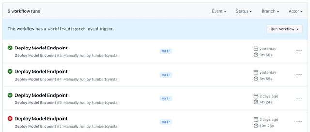
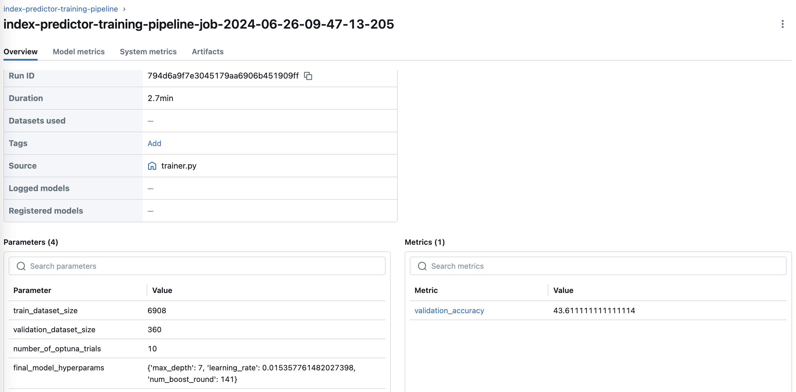
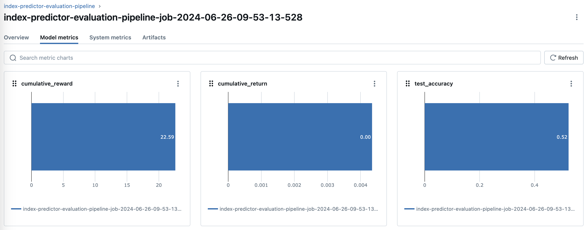

## Index Predictor

Team project for MLOps course at Harbour.Space University on Jun 2024.

[Project design document](https://docs.google.com/document/d/1OqSScPe_MWzLqwbktw-1_l9rWeZ2Yo2mvsqVpKOm9kk/edit?usp=sharing)

### Pipeline

After tagging on github, [A github action](.github/workflows/pipeline.yml) is triggered and the model pipeline starts in a self-hosted github runner (we hosted this runner in jupyter lab), the [pipeline](src/pipeline/create.py) consists of:

1. Data collector, sagemaker processing job. [(Script)](src/data/collector.py) [(Job)](src/pipeline/steps/collector.py)
    * Fetches last 30 days of minutely data from Yahoo Finance.

2. Data processor, sagemaker processing job. [(Script)](src/data/processor.py) [(Job)](src/pipeline/steps/processor.py)
    * Extracts day of week, minute, and hour, and one hot encodes day of week
    * Splits into test, train and validation datasets and lags the dataset, with data of the last 30 minutes 
    * Ingests the data in the feature store
    * Stores dataset sizes in an output s3 json file, that will be used in training to know how much to wait for features to be ready in feature store
    * Using manual version column in feature store, to allow semantic versioning and for simplicity

3. Model training, sagemaker training job. [(Script)](src/models/trainer.py) [(Job)](src/pipeline/steps/trainer.py)
    * Uses sagemaker XGBoost estimator
    * Uses optuna for model hyperparameter tuning
    * Tracks parameters, model hyperparameters, and accuracy using mlflow experiment tracking
    * Loads data from feature store, using dataset size to know how much to wait for features to be ready
    * Stores the model as artifact

4. Model evaluation, sagemaker processing job. [(Script)](src/models/evaluator.py) [(Job)](src/pipeline/steps/evaluator.py)
    * Evaluates the model from 3. Model training step on the test dataset
    * Tracks test metrics and parameters using mlflow experiment tracking
    * Loads data from feature store

5. [Conditional step](src/pipeline/steps/conditional.py)
    * Checks metrics of the model computed in 4. Model evaluation
        * Accuracy on test dataset should be higher than the accuracy threshold
        * Cumulative return on the test dataset shoud be higher than the cumulative return threshold
    * If the model satisfies the metrics, it is registered in the model registry
    * If the model does not satisfy the metrics, the pipeline is considered failed

### Model deployment

After model is manually approved in the model registry, it is possible to trigger manually on GitHub, a [model deployment action](.github/workflows/deploy-model-endpoint.yml) that:

* Automatically [deploys the model](src/model_deployment/deploy.py) to a sagemaker endpoint, for real-time inference
* Enables data capture so that data sent to the model can be captured for monitoring purposes

### MLFlow experiment tracking

The following experiments were tracked to MLFlow:

* Model Training in the pipeline
* Model Evaluation in the pipeline
* [Model Training Notebook](src/model_training.ipynb)

From experiment, we keep track of:

1. Parameters
    * Sizes of train, validation, and test datasets
    * Best hyper-parameters of chosen model
2. Metrics
    * Accuracy
    * Cumulative return
2. Artifacts
    * Model

Example experiments in MLFlow:

### Other notebooks

1. [Inference](src/inference.ipynb)

    * Inference notebook that allows to get prediction from model endpoint
    * Fetches last 30 available minutes of data from Yahoo Finance
    * Processes the data in a synchronous way
    * Calls the model endpoint to get the results

2. [Feature Store](src/feature_store.ipynb)

    * Notebook used to create the feature store and define the features
    * Ingest example dataset

3. [Model registry](src/model_registry.ipynb)

    * Notebook used to create the model registry
    * Upload example model

4. [Model training](src/model_training.ipynb)

    * Trains the following models:
        * XGBoost
        * Random Forest
    * Compares results of:
        * XGBoost
        * Random Forest
        * Moving Averages
    * Tracks experiments
    * Used to generate plots

### Monitoring

1. [Data Quality Monitoring](src/monitoring/data_quality_monitoring.ipynb)

    * Runs baselining job with train dataset, to suggest constraints and compute metrics to check for data drifts
    * Runs manual monitoring job
    * Creates schedule for monitoring jobs
    * Tries violations by data drift, by sending negative version of the dataset to the model endpoint.

2. [Model Monitoring](src/monitoring/model_monitoring.ipynb)

    * Adds predictions and probabilities to the test dataset to be used for baselining job
    * Runs baselining job with test dataset and predictions, to compute metrics and suggest constraints
    * Creates schedule for monitoring jobs