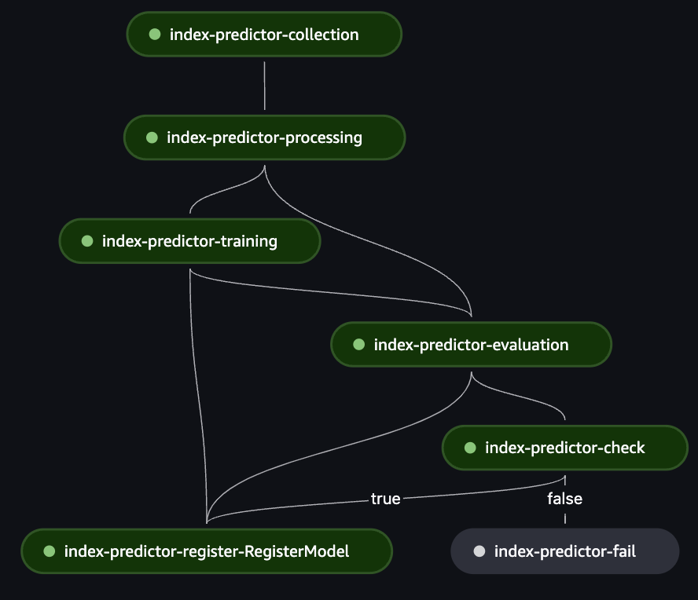

## Index Predictor

Team project for MLOps course at Harbour.Space University on Jun 2024.

[Project design document](https://docs.google.com/document/d/1OqSScPe_MWzLqwbktw-1_l9rWeZ2Yo2mvsqVpKOm9kk/edit?usp=sharing)

### Pipeline

After tagging on github, [A github action](.github/workflows/pipeline.yml) is triggered and the model pipeline starts in a self-hosted github runner (we hosted this runner in jupyter lab), the [pipeline](src/pipeline/create.py) consists of:

1. Data collector, sagemaker processing job. [(Script)](src/data/collector.py) [(Job)](src/pipeline/steps/collector.py)
    * Fetches last 30 days of minutely data from Yahoo Finance.

2. Data processor, sagemaker processing job. [(Script)](src/data/processor.py) [(Job)](src/pipeline/steps/processor.py)
    * Extracts day of week, minute, and hour, and one hot encodes day of week
    * Splits into test, train and validation datasets and lags the dataset, with data of the last 30 minutes 
    * Ingests the data in the feature store
    * Stores dataset sizes in an output s3 json file, that will be used in training to know how much to wait for features to be ready in feature store
    * Using manual version column in feature store, to allow semantic versioning and for simplicity

3. Model training, sagemaker training job. [(Script)](src/models/trainer.py) [(Job)](src/pipeline/steps/trainer.py)
    * Uses sagemaker XGBoost estimator
    * Uses optuna for model hyperparameter tuning
    * Tracks parameters, model hyperparameters, and accuracy using mlflow experiment tracking
    * Loads data from feature store, using dataset size to know how much to wait for features to be ready
    * Stores the model as artifact

4. Model evaluation, sagemaker processing job. [(Script)](src/models/evaluator.py) [(Job)](src/pipeline/steps/evaluator.py)
    * Evaluates the model from 3. Model training step on the test dataset
    * Tracks test metrics and parameters using mlflow experiment tracking
    * Loads data from feature store

5. [Conditional step](src/pipeline/steps/conditional.py)
    * Checks metrics of the model computed in 4. Model evaluation
        * Accuracy on test dataset should be higher than the accuracy threshold
        * Cumulative return on the test dataset shoud be higher than the cumulative return threshold
    * If the model satisfies the metrics, it is registered in the model registry
    * If the model does not satisfy the metrics, the pipeline is considered failed

### Model deployment

After model is manually approved in the model registry, it is possible to trigger manually on GitHub, a [model deployment action](.github/workflows/deploy-model-endpoint.yml) that:

* Automatically [deploys the model](src/model_deployment/deploy.py) to a sagemaker endpoint, for real-time inference
* Enables data capture so that data sent to the model can be captured for monitoring purposes